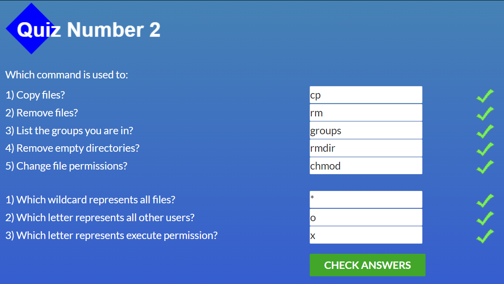
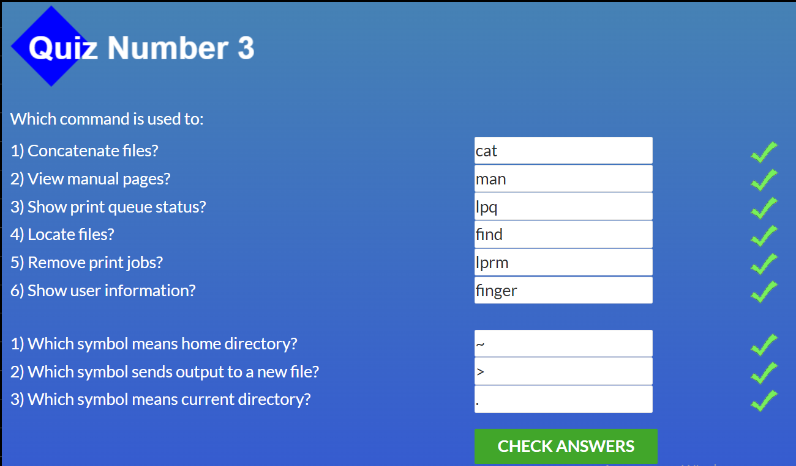
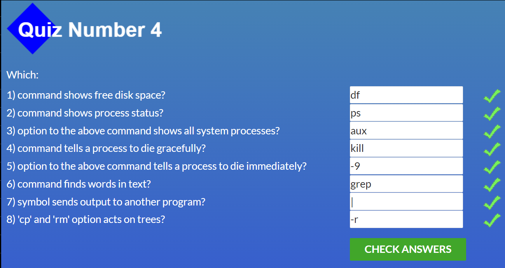

# kottans-frontend

## Linux, Command Line, HTTP Tools

Робота з Linux була для мене нова, а також HTTPS 
Буду використовувати вивчені команди в Git Bash 
Виконані завдання на скрінах (і для мене пам'ятка по командам): 
 
 
 
 

## Git Collaboration

Майже всі "флаги" для мене були новими  
Особливо здивували можливості команд ` git cerry-pick <C1><C2>...` та `git rebase -i HEAD~numb ` 
Планую використовувати всі подальші команди: 

## GIT команди

| Git команда та флаг  | Значення  |
| ------------- | ------------- |
| `git commit`  | створення комміту |
| `-a ` | одночасне виконання команди git add |
| `--amend` | запис змін в попередній комміт |
|` git branch newName ` | створення нової гілки |
| `-d ` | видалення гілки |
|` -D ` | видалення гілки яка не була змерджена |
|` -f HEAD~numb` | переміщення гілки на numb комітів вверх |
| `git checkout nameBranch`| перехід на гілку або комміт |
| `-b ` | одночасне створення і перехід на гілку|
| `-b foo o/main` | слідкування гілки foo за гілкою o/main|
| `HEAD^ ` | переміщення на один комміт вверх |
|` HEAD~numb` | переміщення на numb комітів вверх |
| `git merge nameBranch`  | злиття гілок |
| `--abort` | відміна злиття |
| `git rebase nameBranch`  | переміщення комітів з теперішньої  гілки в вказану |
| `git log ` | виведення інформації про комміти |
| `git reset HEAD~numb` | відміняє зміни numb коммітів  (локальний репозиторій) |
| `git revert HEAD` | відміняє зміни (перепис комміта з протилежним значенням) (віддалений репозиторій) |
|` git cerry-pick <C1><C2>...`| копіює комміти C1 C2 ... до поточного HEAD |
| `git rebase -i HEAD~numb `| переміщення комітів між собою, видалення , обєднання |
| `git clone "httpAdress `|  клонування віддаленого репозиторію до локального|
| `git pull `| завантаження з віддаленого репозиторію в локальний та злиття змін |
| `--rebase`| завантаження з віддаленого репозиторію в локальний та злиття змін методом ребейс |
| `git push`| завантаженн з локального в віддалений і мердже зміни |
| `git push origin source:destination`| завантаженн з локальної гілки source в віддалену гілку destination і мердже зміни, без source видаляє гілку з віддаленого репо |
| `git show`| показує останній комміт|
| `git tag tagName nameCommit`| створення тегу (версії)|
| `git describe nameCommit`| виведення інформ про найближчий тег від комміта( за замовчуванням HEAD) кількість комітів до нього та його хеш|

скріншоти: 
[1 тиждень](./task_git_collaboration/coursera1.png)
[2 тиждень](./task_git_collaboration/coursera2.png)
[3 тиждень](./task_git_collaboration/coursera3.png)
[4 тиждень](./task_git_collaboration/coursera4.png)
[основи](./task_git_collaboration/2.png)
[віддалені репо ](./task_git_collaboration/1.png)

