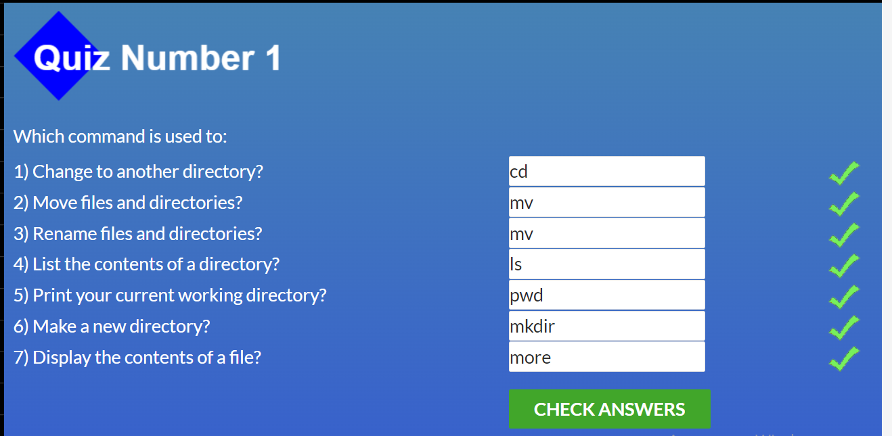

# kottans-frontend

## Object Oriented JS

[Demo](https://oleksandr-heleta.github.io/frontend-nanodegree-arcade-game)|
[Code](https://github.com/Oleksandr-Heleta/frontend-nanodegree-arcade-game/tree/kottans-frogger) 

[CodeWars link](https://www.codewars.com/users/Oleksandr-Heleta) 

OOP- дуже цікава тема, найцікавіше це прототипування об'єків.

## DOM

[Demo](https://oleksandr-heleta.github.io/kottans-DOM_task/)|
[Code](https://github.com/Oleksandr-Heleta/kottans-DOM_task) 

DOM - це справжня магія з якою можна творити дива 
Основне що я зрозумів і взяв на озброєння - це присвоєння listenera на батька для багатьох інтерактивних елементів) 

скріншоти: 
[DOM manipulation](./task_js_dom/DOMManipulation.png)|
[Algorithm Scripting](./task_js_dom/AlgorithmScripting.png)

## html-css-popup

[Demo](https://oleksandr-heleta.github.io/kottans-popup/)|
[Code](https://github.com/Oleksandr-Heleta/kottans-popup) 

Практика допомогла узагальнити знання 
Дізнався про псевдоклас checked та його можливості, а також про властивість appearence для input 

## JS Basics

Загалом JS для мене не був новим, по крайній мірі базові речі.  
Я біль ніж впевнений що він мене ще здивує коли буду вивчати його глибше. 
скріншоти: 
[4 тиждень](./task_js_basics/coursera4.png)|
[Basic JS](./task_js_basics/BasicJS.png)|
[ES6](./task_js_basics/ES6.png)|
[Basic Data Structures](./task_js_basics/BasicDataStructures.png)|
[Basic Algorithm Scripting](./task_js_basics/BasicAlgorithmScripting.png)|
[Functional Programming](./task_js_basics/FunctionalProgramming.png)|
[Algorithm Scripting](./task_js_basics/AlgorithmScripting.png)|
 

## Responsive Web Design

Гріди і брейкпоінти 
Здивувало що за допомогою двох команд (grid-template / grid-area) можна стилізувати будьякої складності сайт 
Планую досконало опанувати гріди та використовувати їх 
скріншоти: 
[Відео по флексах](./task_responsive_web_design/flexvideo.png)|
[Відео по грідах](./task_responsive_web_design/gridvideo.png)|
[Flexbox Froggy](./task_responsive_web_design/froggy.png)|
[Grid Gerden](./task_responsive_web_design/garden.png) 

Ігри:
[Grid Gerden](http://cssgridgarden.com/)|
[Flexbox Froggy](http://flexboxfroggy.com/)

## Intro to HTML and CSS

Важливість написання симантично вірної верстки 
Здивувало що можна вказувати селектори класів за допомогою атрибутів (відмінних від id i class) 
Буду намагатись писати симантично вірні html файли 
скріншоти: 
[1 тиждень](./task_html_css_intro/week1.png)|
[2 тиждень](./task_html_css_intro/week2.png)|
[практичні заняття](./task_html_css_intro/practise.png)

## Linux CLI, and HTTP

Робота з Linux була для мене нова, а також HTTPS 
Буду використовувати вивчені команди в Git Bash 
Виконані завдання на скрінах (і для мене пам'ятка по командам): 
 
 
 
 

## Git Collaboration

Майже всі "флаги" для мене були новими  
Особливо здивували можливості команд ` git cerry-pick <C1><C2>...` та `git rebase -i HEAD~numb ` 
Планую використовувати всі подальші команди: 

## GIT команди

| Git команда та флаг  | Значення  |
| ------------- | ------------- |
| `git commit`  | створення комміту |
| `-a ` | одночасне виконання команди git add |
| `--amend` | запис змін в попередній комміт |
|` git branch newName ` | створення нової гілки |
| `-d ` | видалення гілки |
|` -D ` | видалення гілки яка не була змерджена |
|` -f HEAD~numb` | переміщення гілки на numb комітів вверх |
| `git checkout nameBranch`| перехід на гілку або комміт |
| `-b ` | одночасне створення і перехід на гілку|
| `-b foo o/main` | слідкування гілки foo за гілкою o/main|
| `HEAD^ ` | переміщення на один комміт вверх |
|` HEAD~numb` | переміщення на numb комітів вверх |
| `git merge nameBranch`  | злиття гілок |
| `--abort` | відміна злиття |
| `git rebase nameBranch`  | переміщення комітів з теперішньої  гілки в вказану |
| `git log ` | виведення інформації про комміти |
| `git reset HEAD~numb` | відміняє зміни numb коммітів  (локальний репозиторій) |
| `git revert HEAD` | відміняє зміни (перепис комміта з протилежним значенням) (віддалений репозиторій) |
|` git cerry-pick <C1><C2>...`| копіює комміти C1 C2 ... до поточного HEAD |
| `git rebase -i HEAD~numb `| переміщення комітів між собою, видалення , обєднання |
| `git clone "httpAdress `|  клонування віддаленого репозиторію до локального|
| `git pull `| завантаження з віддаленого репозиторію в локальний та злиття змін |
| `--rebase`| завантаження з віддаленого репозиторію в локальний та злиття змін методом ребейс |
| `git push`| завантаженн з локального в віддалений і мердже зміни |
| `git push origin source:destination`| завантаженн з локальної гілки source в віддалену гілку destination і мердже зміни, без source видаляє гілку з віддаленого репо |
| `git show`| показує останній комміт|
| `git tag tagName nameCommit`| створення тегу (версії)|
| `git describe nameCommit`| виведення інформ про найближчий тег від комміта( за замовчуванням HEAD) кількість комітів до нього та його хеш|

скріншоти: 
[1 тиждень](./task_git_collaboration/coursera1.png)
[2 тиждень](./task_git_collaboration/coursera2.png)
[3 тиждень](./task_git_collaboration/coursera3.png)
[4 тиждень](./task_git_collaboration/coursera4.png)
[основи](./task_git_collaboration/2.png)
[віддалені репо ](./task_git_collaboration/1.png)

